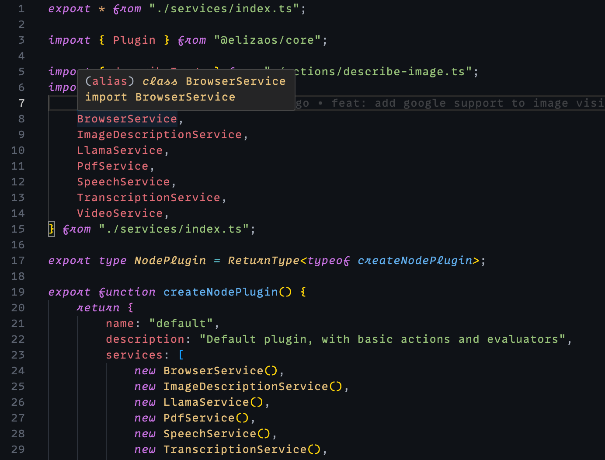

# Modest Dark Theme

A sophisticated dark theme for VSCode and Windsurf, inspired by Tim Cole's Modest Dark theme for Zed. Created by fourcolors.

## Features

- Beautiful dark color scheme optimized for readability
- Carefully selected colors for syntax highlighting
- Consistent styling across VSCode and Windsurf
- Modern UI with subtle borders and shadows
- Great TypeScript/JavaScript support with semantic highlighting

## Color Palette

The theme uses carefully selected colors that work harmoniously together:

- Background: `#0F1219`
- Text: `#abb2bf`
- Keywords: `#ca72e4` (purple, italic)
- Functions: `#5ab0f6` (blue, italic)
- Strings: `#97ca72` (green)
- Variables: `#e06c75` (red)
- Constants: `#d99a5e` (orange)
- Types/Classes: `#ebc275` (yellow)
- Comments: `#546178` (gray, italic)
- Operators: `#abb2bf` (light gray)

The screenshot above shows these colors in action, demonstrating TypeScript code with imports, types, and service declarations.

## Installation

### VSCode
1. Download the `.vsix` file from the releases
2. Run `code --install-extension modest-dark-theme-0.0.1.vsix`
3. Select "Modest Dark" from the theme selector (Cmd+K Cmd+T)

### Cursor
1. Download the `.vsix` file from the releases
2. Run `cursor --install-extension modest-dark-theme-0.0.1.vsix`
3. Select "Modest Dark" from the theme selector

### Windsurf
1. Copy the `windsurf-modest-dark.json` file to your Windsurf themes directory
2. Select "Modest Dark" from the theme selector in settings

## Credits

- Original Modest Dark theme by Tim Cole for Zed Editor
- Port to VSCode and Windsurf by fourcolors

## License

MIT License - see LICENSE file for details

## Contributing

Contributions are welcome! Please feel free to submit a Pull Request.
